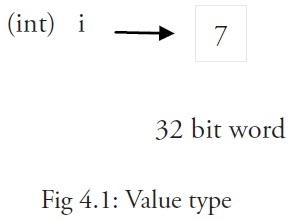
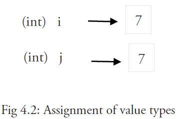
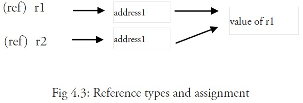

Go to [ HOME ](../learing-go.md)
 <h1> 1. 基本语法结构 </h1>

---

## Go 标记

>Go 程序可以由多个标记组成，可以是关键字，标识符，常量，字符串，符号。如以下 GO 语句由 6 个标记组成：

```
fmt.Println("Hello, World!")
6 个标记是(每行一个)：

1. fmt
2. .
3. Println
4. (
5. "Hello, World!"
6. )

```

## 行分隔符
在 Go 程序中，一行代表一个语句结束。每个语句不需要像 C 家族中的其它语言一样以分号 ; 结尾，因为这些工作都将由 Go 编译器自动完成。

如果你打算将多个语句写在同一行，它们则必须使用 ; 人为区分，但在实际开发中我们并不鼓励这种做法。

以下为两个语句：
```
fmt.Println("Hello, World!")
fmt.Println("runoob.com")

```


## 注释
注释不会被编译，每一个包应该有相关注释。

单行注释是最常见的注释形式，你可以在任何地方使用以 // 开头的单行注释。多行注释也叫块注释，均已以 /* 开头，并以 */ 结尾。如：
```
// 单行注释
/*
 Author by 菜鸟教程
 我是多行注释
 */
```

## 标识符
标识符用来命名变量、类型等程序实体。一个标识符实际上就是一个或是多个字母(A~Z和a~z)数字(0~9)、下划线_组成的序列，但是第一个字符必须是字母或下划线而不能是数字。

以下是有效的标识符：

```
mahesh   kumar   abc   move_name   a_123
myname50   _temp   j   a23b9   retVal
```
以下是无效的标识符：
```
1ab（以数字开头）
case（Go 语言的关键字）
a+b（运算符是不允许的）
```
## 字符串连接
Go 语言的字符串连接可以通过 + 实现：

实例
```
package main
import "fmt"
func main() {
    fmt.Println("Google" + "Runoob")
}
```
以上实例输出结果为：

> GoogleRunoob

## 关键字
下面列举了 Go 代码中会使用到的 25 个关键字或保留字：

|||||
|---|---|---|---|
|break|default|func|interface|select|
|case|defer|go|map|struct|
|chan|else|	goto|package|switch|
|const|	fallthrough	|if|range|type|
|continue|for|import|return|	var|

除了以上介绍的这些关键字，Go 语言还有 36 个预定义标识符：

||||||||||
|---|---|---|---|---|---|---|---|---|
append|	bool|	byte|	cap|	close|	complex|	complex64|	complex128|	uint16|
copy|	false|	float32|	float64|	imag|	int|	int8|	int16|	uint32|
int32|	int64|	iota|	len|	make|	new|	nil|	panic|	uint64|
print|	println|	real|	recover|	string|	true|	uint|	uint8|	uintptr|


+ 程序一般由关键字、常量、变量、运算符、类型和函数组成。
+ 程序中可能会使用到这些分隔符：括号 ()，中括号 [] 和大括号 {}。
+ 程序中可能会使用到这些标点符号：.、,、;、: 和 …。

##  Go 语言的空格
在 Go 语言中，空格通常用于分隔标识符、关键字、运算符和表达式，以提高代码的可读性。

Go 语言中变量的声明必须使用空格隔开，如：

```
var x int
const Pi float64 = 3.14159265358979323846
```
在运算符和操作数之间要使用空格能让程序更易阅读：

无空格：
```
fruit=apples+oranges;
```
在变量与运算符间加入空格，程序看起来更加美观，如：
```
fruit = apples + oranges; 
```
在关键字和表达式之间要使用空格。

例如：
```
if x > 0 {
    // do something
}
```
在函数调用时，函数名和左边等号之间要使用空格，参数之间也要使用空格。

例如：
```
result := add(2, 3)
```

## 格式化字符串
Go 语言中使用 fmt.Sprintf 或 fmt.Printf 格式化字符串并赋值给新串：

+ Sprintf 根据格式化参数生成格式化的字符串并返回该字符串。
+ Printf 根据格式化参数生成格式化的字符串并写入标准输出。

Sprintf 实例
```
package main

import (
    "fmt"
)

func main() {
   // %d 表示整型数字，%s 表示字符串
    var stockcode=123
    var enddate="2020-12-31"
    var url="Code=%d&endDate=%s"
    var target_url=fmt.Sprintf(url,stockcode,enddate)
    fmt.Println(target_url)
}
```
输出结果为：

> Code=123&endDate=2020-12-31

Printf 实例

```
package main

import (
    "fmt"
)

func main() {
   // %d 表示整型数字，%s 表示字符串
    var stockcode=123
    var enddate="2020-12-31"
    var url="Code=%d&endDate=%s"
    fmt.Printf(url,stockcode,enddate)
}
```
输出结果为：

>Code=123&endDate=2020-12-31


<h1>2. 变量</h1>
Go 语言变量名由字母 、数字 、下划线组成，其中首个字符不能为数字
声明变量的一般形式是使用 var 关键字

>var identifier type
    
```
    // 第一种，指定变量类型，如果没有初始化，则变量默认为零值。只定义,默认值
    var name int  
    
    //第二种，根据值自行判定变量类型。//定义&初始化
    var id = 1        
    var key = "star"

    //第三种 简短形式，使用 := 赋值操作符   //简洁定义&声明
    short := "ll"
  
    //NOTE: 这是使用变量的首选形式，但是它只能被用在函数体内，
   // 而不可以用于全局变量的声明与赋值。使用操作符 := 可以高效地创建一个新的变量，称之为初始化声明
  
```   

多变量声明

> var identifier1, identifier2 type

```
    //类型相同多个变量, 非全局变量
    var x, y, z string

    var o, p, q = "o", 2, "q"

    vname1, vname2, vname3 := v1, v2, v3 // 出现在 := 左侧的变量不应该是已经被声明过的，否则会导致编译错误

// 这种因式分解关键字的写法一般用于声明全局变量
var (
    vname1 v_type1
    vname2 v_type2
)

```

值类型和引用类型(*很重要)

所有像 int、float、bool 和 string 这些基本类型都属于值类型，使用这些类型的变量直接指向存在内存中的值：



当使用等号 = 将一个变量的值赋值给另一个变量时，如：j = i，实际上是在内存中将 i 的值进行了拷贝：



你可以通过 &i 来获取变量 i 的内存地址，例如：0xf840000040（每次的地址都可能不一样）。
值类型变量的值存储在堆中。

内存地址会根据机器的不同而有所不同，甚至相同的程序在不同的机器上执行后也会有不同的内存地址。因为每台机器可能有不同的存储器布局，并且位置分配也可能不同。

更复杂的数据通常会需要使用多个字，这些数据一般使用引用类型保存。

一个引用类型的变量 r1 存储的是 r1 的值所在的内存地址（数字），或内存地址中第一个字所在的位置。



这个内存地址称之为指针，这个指针实际上也被存在另外的某一个值中。

同一个引用类型的指针指向的多个字可以是在连续的内存地址中（内存布局是连续的），这也是计算效率最高的一种存储形式；也可以将这些字分散存放在内存中，每个字都指示了下一个字所在的内存地址。

当使用赋值语句 r2 = r1 时，只有引用（地址）被复制。

如果 r1 的值被改变了，那么这个值的所有引用都会指向被修改后的内容，在这个例子中，r2 也会受到影响。


<h1>3. 常量</h1>

常量是一个简单值的标识符，在程序运行时，不会被修改的量。
常量中的数据类型只可以是布尔型、数字型（整数型、浮点型和复数）和字符串型。

常量的定义格式：
> const identifier [type] = value
>

你可以省略类型说明符 [type]，因为编译器可以根据变量的值来推断其类型。

>显式类型定义： const B string = "abc"

>隐式类型定义： const C = "abc"

多个相同类型的声明可以简写为：
>const c_name1, c_name2 = value1, value2

```
 const PI = 3.1415926
 const PI_2 float64 = 3.1415926

// 常量还可以用作枚举：
 const (
   P_1 = 1
   P_2 = 2
)

const  (
    P_3 int = 1
    P_4     = 2
    P_5
    P_6 = "7"
    P_7
)
// NOTE: 注意P_5/P_6的值


```

<h5> iota </h5>
iota，特殊常量，可以认为是一个可以被编译器修改的常量。

iota 在 const关键字出现时将被重置为 0(const 内部的第一行之前)，const 中每新增一行常量声明将使 iota 计数一次(iota 可理解为 const 语句块中的行索引)。

iota 可以被用作枚举值：

```
const (
    a = iota
    b = iota
    c = iota
)

// 特殊常量iota
const (
    E1 = iota
    //E1 = iota + 1
    //E1 = iota << 1
    E2
    E3

    E4 = "err"
    E5
    E6 = iota
    E7
    E8 = iota + 1
    E9
)

// 重新开始了
const (
    E10 = iota
)

```

---
PRE [HOME](../learing-go.md)    
NEXT >> [基础数据类型](../part2/part.md)